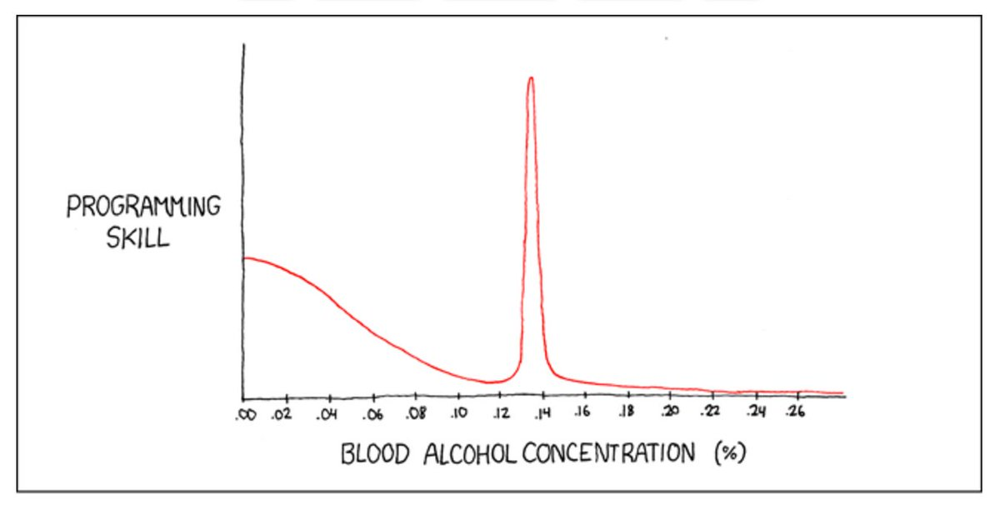
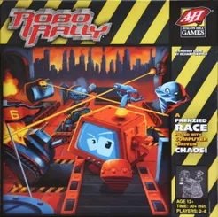

## Robo Rally by BallmersPeak

Group name: BallmersPeak 

Utviklere:

-   Magnus Matre
-   Simen Forland
-   Vetle Grim Hjelmtvedt
-   Philip Perhult Johnsen
-   Sverre Johnsen

## General

### About 

This repository is a Java implementation of the board game "RoboRally", built with the libGDX library. 

### Technologies
-   JDK 9 or higher
-   JUnit 5
-   libGDX 1.9

### How to run

1.  Clone the repository using the HTTPS link provided above.
2.  Open the project as a Maven project in your favourite IDE.
3.  Once imported, run Maven package. (JDK 9 or higher).
4.  Run the project or execute the jar produced in step 3.