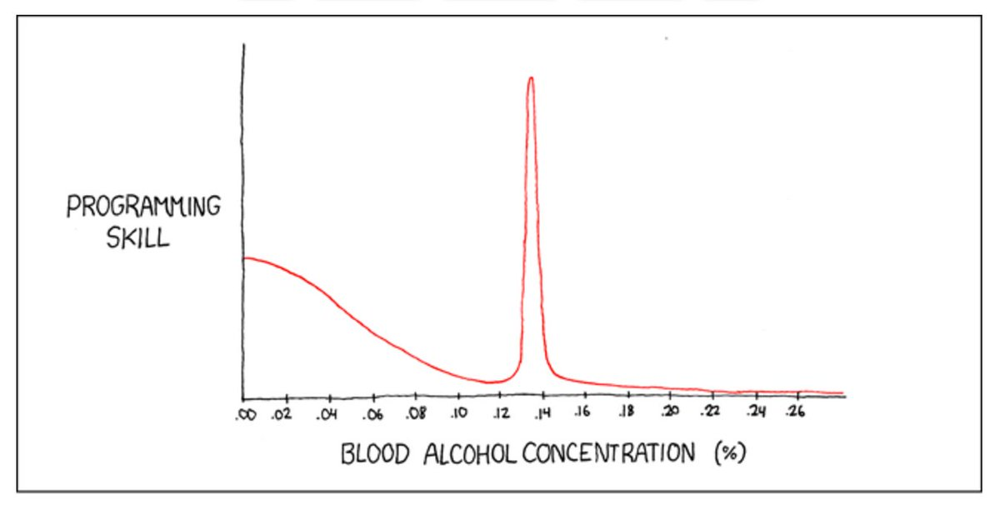
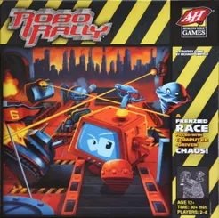

## RoboRally by BalmersPeak

Gruppenavn: BalmersPeak
Utviklere:
 - Magnus Matre
 - Simen Forland
 - Vetle Grim Hjelmtvedt
 - Philip Perhult Johnsen
 - Sverre Johnsen

## General

### About 

This repository is a Java implementation of the board game "RoboRally", built with the libGDX library. 

### How to run

1. Clone the repository using the HTTPS link provided above.
2. Open the project as a Maven project in your favorite IDE.
3. Once imported, run Maven deploy. (JDK 8 or higher).
4. Run the project or execute the jar produced in step 3.

